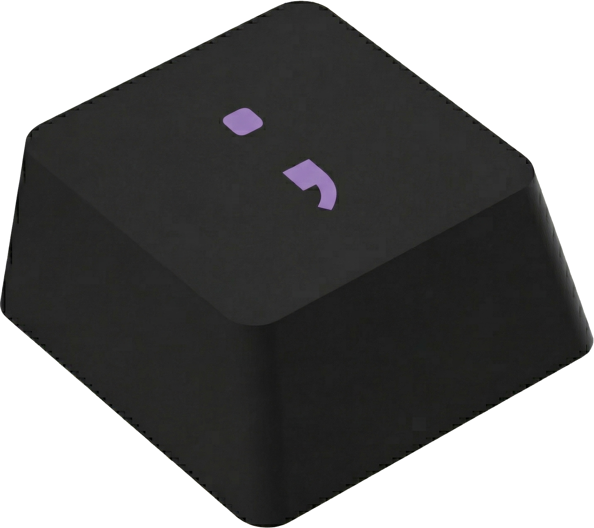

<div align="center">
  
  <h1>Trebor Labs</h1>
  <p>E-commerce de teclados mecánicos custom y kits Raspberry Pi — mercado peruano</p>

  
  
  
  
  
  
</div>

---

## Stack

| Capa | Tecnología |
|---|---|
| Frontend | React 19 + React Router 7 + Vite 6 + Tailwind CSS v3 |
| Backend | Fastify v5 (ESM) + Prisma v6 |
| Base de datos | PostgreSQL 16 |
| Auth | JWT + OAuth (Google, GitHub) + email/password |
| Pagos | MercadoPago |
| Email | Nodemailer (Gmail App Password) |
| Dev | Docker Compose con hot reload |

---

## Estructura del repositorio

```
TreborLabs/
├── apps/
│   ├── backend/               # Fastify + Prisma
│   │   ├── prisma/
│   │   │   └── schema.prisma
│   │   ├── src/
│   │   │   ├── plugins/       # prisma, authenticate, requireAdmin
│   │   │   ├── routes/        # auth, products, posts, checkout, orders…
│   │   │   ├── services/      # email.js
│   │   │   └── index.js       # entry point
│   │   ├── uploads/           # imágenes subidas (gitignored)
│   │   ├── .env.example
│   │   └── Dockerfile
│   └── frontend/              # React + Vite + Tailwind
│       ├── public/
│       │   └── logo.png
│       ├── src/
│       │   ├── components/    # Navbar, Footer, AdminLayout, SEOMeta…
│       │   ├── context/       # AuthContext, CartContext
│       │   ├── hooks/
│       │   ├── views/         # 20+ vistas (Home, Checkout, Admin*, Blog…)
│       │   ├── App.jsx
│       │   └── index.css      # Design tokens + logo animation
│       ├── .env.example
│       └── Dockerfile
└── docker/
    └── docker-compose.yml     # postgres + backend + frontend
```

---

## Design system — Circuit Amethyst

Dark theme Material Design 3 con paleta amethyst/púrpura, generado con Google Stitch.

| Token Tailwind | Hex | Uso |
|---|---|---|
| `primary` | `#d6baff` | Acentos, CTA buttons, íconos activos |
| `surface` | `#131315` | Fondo base |
| `surface-container` | `#201f21` | Cards, paneles |
| `on-surface` | `#e5e1e4` | Texto principal |
| `error` | `#ffb4ab` | Estados de error |

**Reglas que no se rompen:**
- Border radius máximo: `rounded-xl` (8px). Nunca `rounded-2xl` o mayor.
- Tipografía: `font-headline` (Space Grotesk) para títulos, `font-mono` (JetBrains Mono) para precios.
- Colores: siempre tokens del sistema, nunca hardcoded.
- Iconos: Material Symbols Outlined exclusivamente.

### Logo animation

El logo en Navbar/Login/Checkout tiene un arco luminoso que traza su contorno:

```jsx
<div className="relative w-9 h-9">
  
  <div className="logo-ring-base" aria-hidden="true" />
  <div className="logo-tracer-ring" aria-hidden="true" />
</div>
```

Técnica: CSS `mask-composite: exclude` + `@property --logo-angle` (Houdini). Velocidad: 5s linear infinite.

---

## Levantar con Docker

### Requisitos

- Docker + Docker Compose
- Git

### Primera vez en cualquier máquina

```bash
# 1. Clonar el repo
git clone <url-del-repo> TreborLabs
cd TreborLabs

# 2. Variables de entorno
cp apps/backend/.env.example  apps/backend/.env
cp apps/frontend/.env.example apps/frontend/.env
# Editar apps/backend/.env con tus credenciales reales

# 3. Levantar
./deploy.sh
```

`deploy.sh` construye las imágenes, levanta los contenedores y espera a que el backend esté listo antes de terminar.

```
Frontend → http://localhost:5173
Backend  → http://localhost:3001
Admin    → http://localhost:5173/admin
```

### Comandos del día a día

```bash
./deploy.sh          # Levantar (o rebuildar tras cambios de config)
./stop.sh            # Apagar
cd docker && docker compose up -d   # Encender sin rebuildar
```

### Arranque automático al encender la máquina

Con `restart: unless-stopped` en el compose, los contenedores vuelven solos si el sistema se reinicia. Para activarlo:

```bash
sudo systemctl enable docker
```

A partir de ahí: enciendes el PC → Docker arranca → el proyecto está corriendo. Si lo apagaste con `./stop.sh`, no vuelve solo hasta que corras `./deploy.sh` o `docker compose up -d` manualmente.

### Hot reload

| Servicio | Mecanismo |
|---|---|
| Backend | `node --watch src/index.js` — cambios en `src/` visibles de inmediato |
| Frontend | Vite HMR — `src/`, `public/`, `index.html` montados como volumen |
| Config | `vite.config.js`, `package.json` requieren `./deploy.sh` para rebuildar |

### Acceso desde otros dispositivos en la red local

Los puertos 5173 y 3001 ya escuchan en todas las interfaces (`0.0.0.0`). El único paso necesario es abrir esos puertos en el firewall de la máquina donde corre Docker — esto es una configuración del sistema operativo, no del proyecto, y hay que hacerlo una sola vez por máquina:

```bash
sudo ufw allow 5173
sudo ufw allow 3001
```

Luego cualquier dispositivo en la misma red puede entrar con la IP local del servidor:

```bash
# Obtener la IP local de esta máquina
hostname -I | awk '{print $1}'
# Ejemplo: 192.168.1.100

# Desde otros dispositivos:
# http://192.168.1.100:5173  → Frontend
# http://192.168.1.100:3001  → Backend
```

> **OAuth en red local:** Google y GitHub requieren redirect URIs registrados. Si necesitas probar OAuth desde otros dispositivos, agrega `http://TU_IP:3001/auth/google/callback` y `http://TU_IP:3001/auth/github/callback` en las consolas de Google y GitHub respectivamente. Login con email/password funciona sin ningún cambio adicional.

---

## Variables de entorno

### `apps/backend/.env`

| Variable | Descripción |
|---|---|
| `NODE_ENV` | `development` \| `production` |
| `DATABASE_URL` | PostgreSQL connection string |
| `PORT` | Puerto del backend (default: 3001) |
| `BACKEND_URL` | URL pública del backend |
| `FRONTEND_URL` | URL pública del frontend |
| `JWT_SECRET` | Mínimo 32 chars. **Requerido en producción.** |
| `ADMIN_EMAIL` | Email del admin inicial |
| `ADMIN_PASSWORD` | Password del admin inicial |
| `GOOGLE_CLIENT_ID` / `GOOGLE_CLIENT_SECRET` | OAuth Google |
| `GITHUB_CLIENT_ID` / `GITHUB_CLIENT_SECRET` | OAuth GitHub |
| `MP_ACCESS_TOKEN` | MercadoPago access token |
| `GMAIL_USER` / `GMAIL_APP_PASSWORD` | Email transaccional |

### `apps/frontend/.env`

| Variable | Descripción |
|---|---|
| `VITE_API_URL` | URL del backend. Vacío `""` en Docker (usa proxy Vite). |
| `VITE_MP_PUBLIC_KEY` | MercadoPago public key |

> En Docker, `VITE_API_URL=""` y las peticiones van por el proxy de Vite → contenedor backend. No hace falta configurar IPs.

---

## API — endpoints principales

### Auth

| Método | Path | Auth | Descripción |
|---|---|---|---|
| GET | `/auth/google` | No | OAuth Google |
| GET | `/auth/github` | No | OAuth GitHub |
| POST | `/api/auth/register` | No | Registro email/password |
| POST | `/api/auth/login` | No | Login email/password |
| GET | `/auth/me` | JWT | Usuario actual |
| POST | `/auth/logout` | JWT | Logout |

### Catálogo

| Método | Path | Auth | Descripción |
|---|---|---|---|
| GET | `/api/products` | No | Lista productos (`?category=`, `?featured=true`) |
| GET | `/api/products/:slug` | No | Detalle de producto |
| GET | `/api/categories` | No | Categorías habilitadas |
| GET | `/api/posts` | No | Posts publicados |
| GET | `/api/posts/:slug` | No | Post individual |

### Checkout y órdenes

| Método | Path | Auth | Descripción |
|---|---|---|---|
| POST | `/api/checkout` | Opcional | Crear orden + preferencia MP |
| GET | `/api/users/me/orders` | JWT | Órdenes del usuario |

### Admin (requiere rol ADMIN)

| Método | Path | Descripción |
|---|---|---|
| GET/POST/PUT/DELETE | `/api/admin/products` | CRUD productos |
| GET/POST/PUT/DELETE | `/api/admin/posts` | CRUD blog |
| GET/PATCH | `/api/admin/orders/:id` | Gestión de órdenes |
| GET | `/api/admin/stats` | Dashboard stats |
| POST | `/api/admin/upload` | Upload de imágenes |
| GET/POST/PATCH/DELETE | `/api/admin/categories` | Gestión de categorías |
| GET/PUT | `/api/admin/site-config` | CMS homepage |

### Health

| Método | Path | Respuesta |
|---|---|---|
| GET | `/api/health` | `{ status: "ok", version, timestamp }` |
| GET | `/robots.txt` | robots.txt dinámico |
| GET | `/sitemap.xml` | Sitemap con productos y posts |

---

## Autenticación

### JWT

- Payload: `{ userId: string }`
- Duración: 7 días
- Transporte: `Authorization: Bearer <token>`
- Storage cliente: `localStorage` key `trebor_token`

### Flujo OAuth

```
1. Frontend: window.location.href = '/auth/google'
2. Backend: redirige a Google
3. Google: redirige a BACKEND_URL/auth/google/callback
4. Backend: crea/vincula usuario, genera JWT
5. Backend: redirige a FRONTEND_URL/auth/callback?token=<jwt>
6. AuthCallback.jsx: extrae token, llama loginWithToken()
```

---

## Seguridad implementada

- `@fastify/helmet` — HTTP security headers
- `@fastify/rate-limit` — 120 req/min prod, límites estrictos en auth
- DOMPurify — sanitización de HTML en BlogPost
- MIME whitelist para uploads (JPEG, PNG, WebP, GIF, AVIF)
- JWT secret requerido en producción (process.exit si falta)
- Race condition en checkout: `updateMany WHERE stock >= qty` atómico
- Coupon TOCTOU: `updateMany WHERE usedCount < maxUses` atómico
- Order state machine: transiciones válidas en PATCH de órdenes
- Reseñas solo para compradores verificados

---

## Scripts útiles

```bash
# Backend
cd apps/backend
npm run dev           # Desarrollo local
npm run db:push       # Sincronizar schema con DB
npm run db:studio     # Prisma Studio

# Docker
cd docker
docker compose up --build   # Primera vez o tras cambiar config
docker compose up           # Arranques siguientes
docker compose logs -f backend  # Ver logs del backend

# Hacer db:push dentro del contenedor (tras cambiar schema.prisma)
docker exec treborlabs_backend npx prisma db push
```

---

## Estado actual

### Implementado

- Auth completa: email/password + OAuth Google & GitHub + verificación de email
- CRUD Productos con variantes, imágenes, afiche, reseñas
- CRUD Blog con comentarios anidados
- Carrito (localStorage + DB sync) + Checkout con MercadoPago
- Cupones, zonas de envío, devoluciones
- Panel admin completo: Dashboard, Órdenes, Productos, Blog, Usuarios, Cupones, Envíos, Analytics, Devoluciones, Logs, Comentarios, Settings
- Wishlist, Notificaciones, Referrals
- robots.txt + sitemap.xml dinámicos
- Auditoría de seguridad (22 fixes)

### Pendiente

Ver [BACKLOG.md](BACKLOG.md) para el detalle completo de tareas pendientes.
